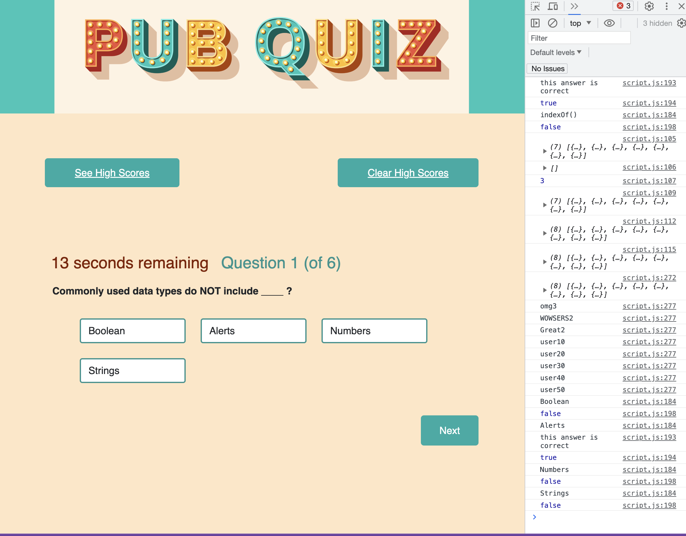

## Title:

    Code Quiz Inquisitor by Jenny

## Description:

   A dynamic timed quiz on coding that saves high scores and tests user knowledge.  

## Installing:

    Basic hosting through GitHub repository.

## Contributors:

    Jenny Wannier Tarzian

    StackOverflow: 
        https://stackoverflow.com/questions/47858518/highscore-in-local-storage-javascript

    StackOverflow:
        https://codedamn.com/news/javascript/how-to-fix-typeerror-foreach-is-not-a-function-in-javascript

## License:

    N/A

## URL:

 https://alathea23.github.io/Coding-Quiz-Inquisitor/

